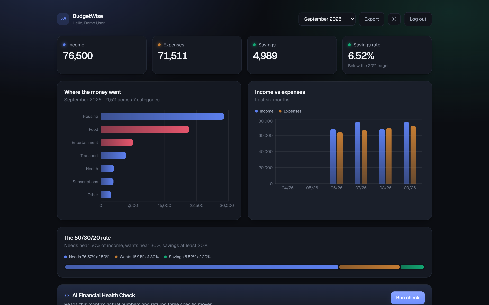
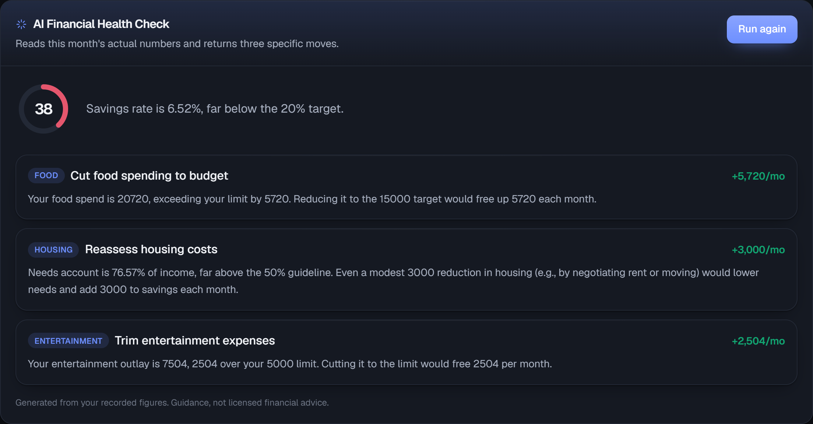
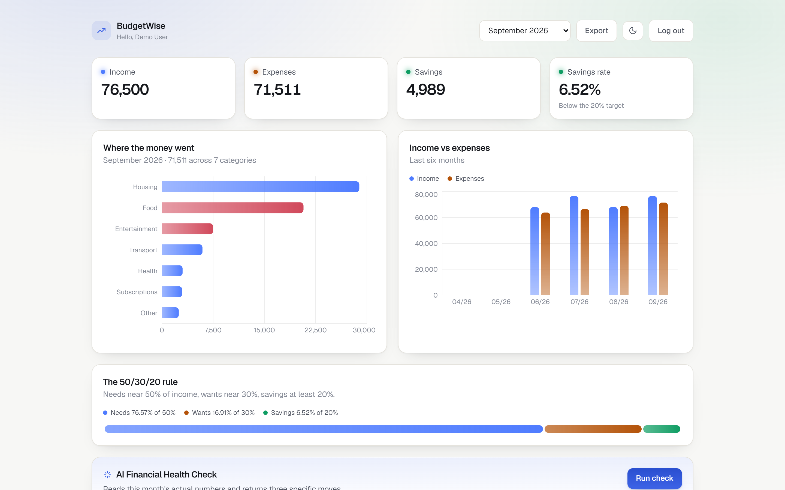
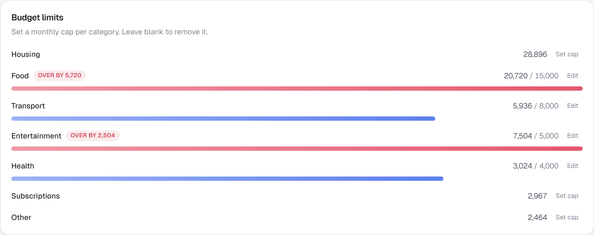
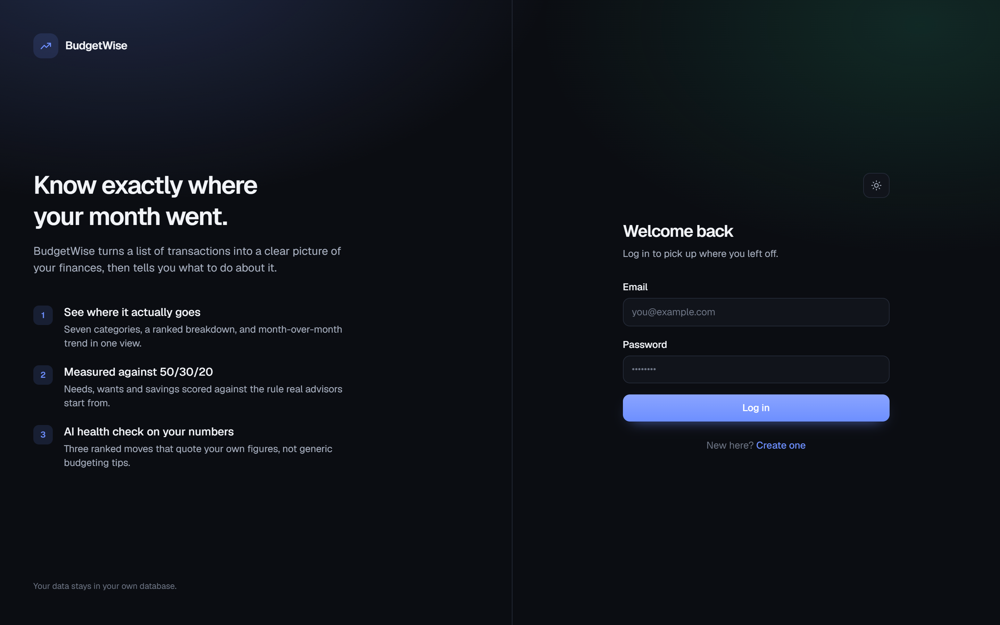

# BudgetWise

Track monthly income and expenses by category, see where the money actually goes, and get an
AI financial health check written against your own numbers.


**Live demo: <https://budgetwise-blue.vercel.app>** — log in with `demo@budgetwise.app` / `demo1234`,
or create your own account.

---

## Screenshots

**Dashboard — dark theme (default)**



**AI Financial Health Check** — a score, a verdict, and three recommendations ranked by the money
each one frees up, every one quoting the user's own figures.



**Dashboard — light theme**



**Budget limits** — spend against each cap, with an over-budget row marked by colour and by the
amount it is over.



**Sign in**



---

## Stack

| Layer | Choice |
|---|---|
| Frontend | Next.js 16 (App Router), React 19, TypeScript, Tailwind v4 |
| Backend | Next.js Route Handlers (Node runtime) |
| Database | Neon Postgres via Prisma 7 with the Neon driver adapter |
| Auth | JWT (`jose`) in an HttpOnly cookie, bcrypt password hashes |
| AI | Groq (`openai/gpt-oss-120b`) with JSON-schema structured output |
| Charts | Recharts |

The same Neon database backs both local development and the deployed app, so what you see
locally is what a reviewer sees.

**A note on the LLM provider.** The brief suggests OpenAI, Anthropic Claude or Google Gemini.
This uses Groq, running `openai/gpt-oss-120b` — OpenAI's open-weights model on Groq's inference
hardware. Two reasons: the health check returns in roughly three seconds rather than ten, which
matters for a button a user waits on, and Groq's API is OpenAI-compatible, so the provider is not
baked into the design. Switching to OpenAI, Anthropic or Gemini means replacing the client and
the response-format call in `src/lib/ai.ts`; the prompt, the schema, the Zod validation and every
caller stay as they are.

---

## Running it locally

Requires Node 20+.

```bash
npm install
cp .env.example .env
npx prisma migrate deploy
npm run db:seed
npm run dev
```

Fill in `DATABASE_URL` before the migrate step; the app needs a reachable Postgres instance.

Open <http://localhost:3000>. Seeded demo login: **demo@budgetwise.app** / **demo1234**, or
create your own account at `/signup`.

### Environment variables

| Variable | Required | What it is |
|---|---|---|
| `DATABASE_URL` | yes | Neon Postgres connection string. Provisioned by the Vercel Neon integration, or copy it from the Neon dashboard. |
| `JWT_SECRET` | yes | Signing secret for session tokens. Generate one with `openssl rand -base64 32`. |
| `GROQ_API_KEY` | for the AI check | From <https://console.groq.com/keys>. Everything else works without it; the health check returns a clear message when it is missing. |
| `GROQ_MODEL` | no | Defaults to `openai/gpt-oss-120b`. |

`.env` is gitignored; `.env.example` ships blank. The key is only ever read server-side.

### Scripts

| Command | Does |
|---|---|
| `npm run dev` | Dev server |
| `npm run build` / `npm start` | Production build and serve |
| `npm run db:migrate` | Apply schema changes |
| `npm run db:seed` | Reset the demo account and reseed it |
| `npm run db:reset` | Drop the database, re-run every migration, reseed |
| `npm run db:studio` | Browse the database in Prisma Studio |
| `npm run smoke` | End-to-end API check against a running server |
| `npm run lint` | ESLint |

`npm run smoke` is the fastest way to confirm everything works: it exercises auth, validation,
expense CRUD, cross-account isolation, budget caps, the summary maths and a live AI call, then
prints a pass/fail line for each. Start the dev server first, then run it in a second terminal.

---

## Features

**Required**

- Signup, login and logout with JWT auth; every data route is scoped to the caller
- Income entries: add, edit, delete, per month
- Expenses across Housing, Food, Transport, Entertainment, Health, Subscriptions and Other
- Dashboard: income vs expenses, category breakdown chart, savings amount and savings rate
- AI Financial Health Check: a score, a verdict, and three ranked recommendations built from
  the user's real figures
- Persistence in Postgres through Prisma

**Also built**

- Month selector with a six-month income-vs-expenses trend chart
- Per-category budget limits with a meter and an over-budget alert
- 50/30/20 breakdown showing needs, wants and savings against their targets
- CSV export of the month: totals, per-category split, and every entry
- Dark and light themes, dark by default, remembered per browser
- Responsive down to phone width

---

## API

All routes take and return JSON. Auth is the `bw_token` HttpOnly cookie; an
`Authorization: Bearer <jwt>` header also works, which makes the API testable with curl.

| Method | Route | Purpose |
|---|---|---|
| `POST` | `/api/auth/signup` | Create account, sets the session cookie |
| `POST` | `/api/auth/login` | Log in |
| `POST` | `/api/auth/logout` | Clear the session |
| `GET` | `/api/auth/me` | Current user |
| `GET` `POST` | `/api/incomes?month=YYYY-MM` | List and create income |
| `PATCH` `DELETE` | `/api/incomes/:id` | Update and delete income |
| `GET` `POST` | `/api/expenses?month=YYYY-MM` | List and create expenses |
| `PATCH` `DELETE` | `/api/expenses/:id` | Update and delete expenses |
| `GET` `PUT` | `/api/budgets` | Read and set a category limit; `amount: null` clears it |
| `GET` | `/api/summary?month=YYYY-MM` | Totals, savings rate, breakdown, 50/30/20, six-month trend |
| `POST` | `/api/ai/health-check?month=YYYY-MM` | Run the AI health check |

```bash
curl -c jar -X POST localhost:3000/api/auth/login \
  -H 'Content-Type: application/json' \
  -d '{"email":"demo@budgetwise.app","password":"demo1234"}'

curl -b jar localhost:3000/api/summary
```

---

## How the AI check works

`src/lib/ai.ts` holds all of it.

1. **The model gets computed figures, not raw rows.** `buildSummary()` produces totals, each
   category as a share of both spend and income, the 50/30/20 position, budget-limit breaches
   and recent-month history. The model never does arithmetic, so it cannot get the arithmetic
   wrong.
2. **Structured output enforces the shape.** The request uses Groq's `json_schema` response
   format in strict mode, with per-field descriptions, and the reply is validated again with Zod
   before it reaches the UI. There is no JSON-from-prose parsing and never four recommendations
   instead of three.
3. **The prompt bans generic advice.** Each recommendation must quote the user's own numbers,
   ranked by money freed up, with 50/30/20 as the yardstick. The prompt also states that the 50
   and 30 targets apply to the grouped categories rather than any single one, and that every
   figure is monthly.
4. **`monthlyImpact` makes the ranking checkable.** Each recommendation carries what it frees up
   per month, shown in the UI and an easy way to see whether the ranking is honest.

Failure paths are handled rather than assumed away: a missing key, a rejected key, a Groq API
error and an unexpected response shape each return a specific message and a 503.

The output is guidance, not licensed financial advice, and the UI says so.

---

## Design notes

- **Dark by default, light on request.** Both themes are defined as CSS custom properties on
  `:root[data-theme]`. A small inline script applies the stored choice before first paint, so
  there is no flash. The choice persists in `localStorage`.
- **The category chart uses one hue, not seven.** Seven categorical colours cannot be told apart
  under colour-vision deficiency; this palette was checked with a contrast and CVD validator and
  failed badly on all-pairs separation. Identity comes from the axis labels instead. Only the
  two-series trend chart uses colour for identity, and that pair passes in both themes.
- **Chart colours are per-theme.** The dark palette is not the light one brightened; each was
  validated against its own surface for lightness, chroma, CVD separation and contrast.
- **Over-budget is never colour alone.** The bar turns red and the row is labelled with the
  amount it is over by.
- **Money is set in tabular figures** so columns do not jitter as values change.

---

## Project layout

```
prisma/schema.prisma      User, Income, Expense, BudgetLimit
prisma/migrations/        Versioned SQL migrations
prisma/seed.ts            Demo account with four months of data
prisma.config.ts          Prisma 7 config: datasource URL and migration paths
scripts/smoke.mjs         End-to-end API check
src/lib/summary.ts        All budget maths, shared by the dashboard and the AI prompt
src/lib/ai.ts             Groq prompt, schema and call
src/lib/auth.ts           JWT sign and verify, session cookie
src/lib/api.ts            Route helpers: auth guard, Zod body parsing, error shaping
src/lib/theme.tsx         Theme store and toggle
src/lib/db.ts             Lazily constructed Prisma client
src/app/globals.css       Theme tokens and component styles
src/app/api/...           REST route handlers
src/components/...        Dashboard, charts, entry panels, budget limits, health check
```

---

## Security notes

- Passwords are bcrypt-hashed at cost 12 and never returned by any endpoint.
- Login returns the same message for an unknown email and a wrong password, so the response
  cannot be used to probe for registered accounts.
- Every write checks the row belongs to the caller before touching it. A valid session carrying
  someone else's record id gets a 404, not their data.
- All request bodies are validated with Zod; the category list is an enum, not free text.
- The session cookie is HttpOnly, SameSite=Lax and Secure in production.
- Secrets come from the environment only.

Known gaps for a real deployment: no rate limiting on the auth or AI endpoints, and the AI route
is unthrottled per user.

---

## Deployment

Live at <https://budgetwise-blue.vercel.app>, deployed on Vercel with the database on Neon
Postgres. Pushes to `master` deploy automatically. The same three environment variables the
app needs locally are set in the Vercel project: `DATABASE_URL`, `JWT_SECRET` and `GROQ_API_KEY`.

Two details that matter when deploying this:

- The Prisma client is created lazily in `src/lib/db.ts`. Next evaluates route modules while
  collecting page data during the build, so constructing a client at module scope makes the
  build fail whenever `DATABASE_URL` is not yet present.
- Migrations are applied with `prisma migrate deploy` against the production database rather
  than being generated at build time.

---

## AI tools used

**Claude Code** (Claude Opus 5), used through an interactive terminal session, with the
assignment brief as the starting spec.

Where it did the most work was the interface: the entire stylesheet and theme system, the
two-theme colour tokens, the dashboard layout, the chart components, and the loading and empty
states. Styling is where the leverage was highest and where I iterated most on the output.

It also generated the first pass of the backend — Prisma schema, route handlers, the JWT and
bcrypt auth, the summary calculations and the Groq prompt — which I then reviewed and directed.
The decisions behind that code were mine:

- Every budget figure is computed in one place, `src/lib/summary.ts`, so the dashboard and the
  AI prompt can never disagree about the same month.
- The model receives computed percentages rather than raw rows, so it never has to do
  arithmetic it could get wrong.
- Structured JSON-schema output instead of parsing prose, so the response shape is guaranteed.
- Ownership is checked on every write rather than trusting the record id in the URL.

Every endpoint was exercised with `npm run smoke` and the UI walked through in the browser, in
both themes, before this was considered done.
